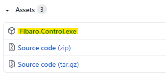
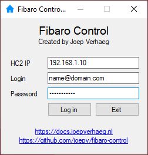
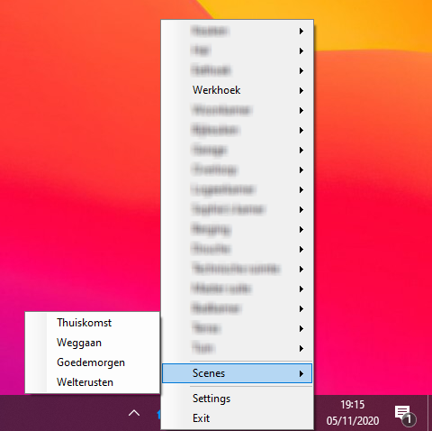
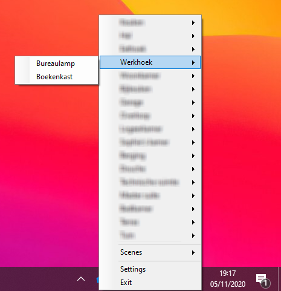

# Fibaro Control (for Windows 10)<!-- omit in toc -->

Small Windows 10 tray application to toggle lights and run scenes from your Fibaro Home Center 2.

## Table of Contents<!-- omit in toc -->

- [Quick download](#quick-download)
- [Manual](#manual)
- [Run a scene](#run-a-scene)
- [Toggle a light on/off](#toggle-a-light-onoff)
- [Reload scenes and lights](#reload-scenes-and-lights)
- [Future roadmap](#future-roadmap)
- [Disclaimer](#disclaimer)

## Quick download

You can download the [latest release](https://github.com/joepv/fibaro-control/releases/latest) from the [releases](https://github.com/joepv/fibaro-control/releases) page.

Just select the `Fibaro.Contol.exe` file from the assets if you just want to use the program.



## Manual

💡 Note: There is no setup. Just [download](https://github.com/joepv/fibaro-control/releases/latest) and copy the `Fibaro Control.exe` file to `C:\Program Files\`.

Start the `Fibaro Control.exe` program and log in to your Fibaro HC2:



The login data is automatically encrypted and saved to the Windows registry hive:

```
HKEY_CURRENT_USER\SOFTWARE\Joep\FibaroControl
```

## Run a scene

* **Right click** the **HC2 icon** in the system tray and go to the **scenes** menu.
* **Click** on a scene to **activate** it.



## Toggle a light on/off

* **Right click** the **HC2 icon** in the system tray and go to the **room** menu where the light is located.
* **Click** on a **light source** to turn it **on** or **off**.



## Reload scenes and lights

* **Right click** the **HC2 icon** in the system tray and click **settings**.
* **Click** the **reload** button.

## Future roadmap

The following functions I may add in the future:

* Toggle (Fibaro) Wall Plug that is configured as a switch.
* Add an option to read the Unifi Controller to determine your Windows 10 device location in the office/house and show only the rooms in that location.

## Disclaimer

This Home Center 2 control program for Windows 10 is my personal project written in C#. I am not affiliated, associated, authorized, endorsed by, or in any way officially connected with Fibar Group S.A.